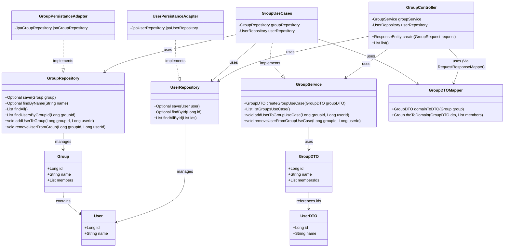
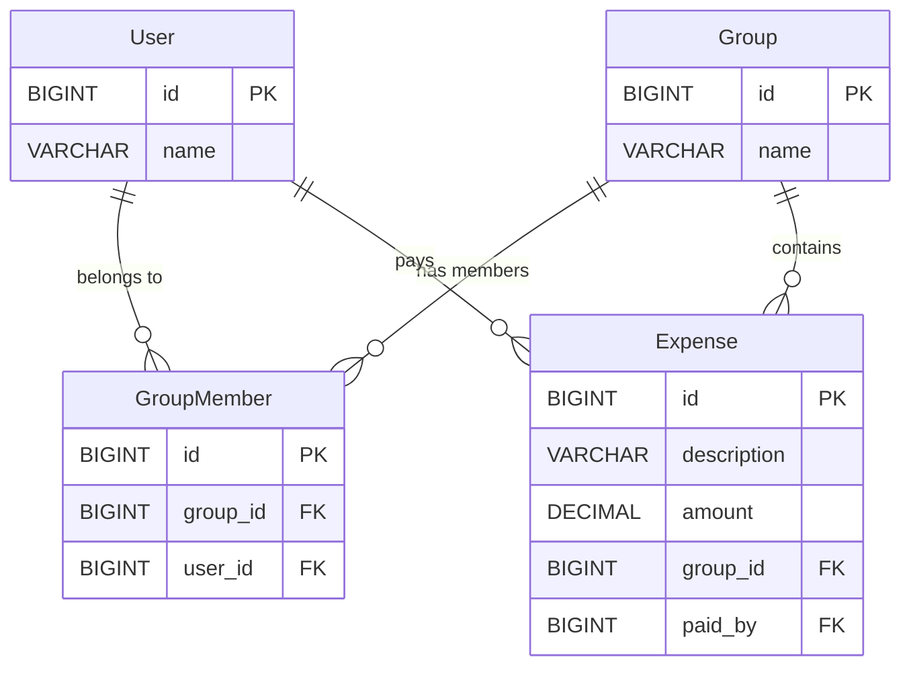
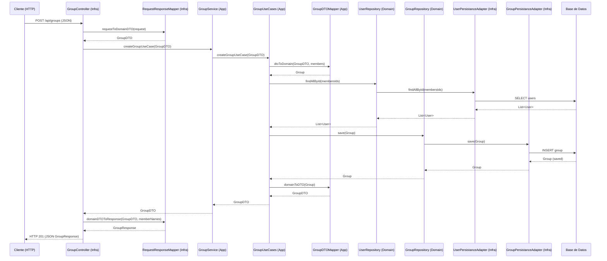

# Split-the-Bill

This project is a simplified version of an expense-sharing application, developed as an academic exercise. The primary focus is to demonstrate a **Pure Hexagonal Architecture** (Ports and Adapters) and clean code principles.


## Project Overview
The goal is to apply modern software design patterns in a controlled environment:
* **Pure Hexagonal Architecture:** Strict separation between business logic and technical implementation.
* **Basic DDD:** Implementation of Domain Entities and Repositories (intentionally omitting Value Objects, UUIDs, and Aggregate Roots for simplicity).
* **SOLID & OOP:** Strong adherence to Single Responsibility and Dependency Inversion.
* **KISS & DRY:** Focused on keeping the solution simple and avoiding unnecessary duplication.
* **Functional Programming:** Extensive use of Java Streams and functional paradigms for data mapping and transformations.
* **Decoupling:** Implementation of **Application DTOs** to ensure the Domain remains agnostic of the external layers.

## Tech Stack
* **Java 21+**
* **Spring Boot 3.x**
* **Maven & Gradle:** (Roadmap: Modularizing the project into independent modules for each layer).
* **H2 Database:** For development and testing.
* **Testing:** JUnit 5 and Mockito for Unit and Integration tests with Docker DB.
* **Angular:** Basic frontend with Angular.

---

---

## Project Structure
The project follows a standard Hexagonal modular organization:

```text
src/main/java/com/yourpackage/splitthebill/
├── application/
│   ├── dto/                # Application Data Transfer Objects (Decoupling)
│   ├── mapper/             # Domain <-> DTO Mapping logic
│   └── usecases/           # Application logic implementation
├── domain/
│   ├── ports/
│   │   ├── inbound/        # Use Case interfaces (Input)
│   │   └── outbound/       # Repository interfaces (Output)
│   └── model/              # Pure Domain Entities (User, Group, Expense)
└── infrastructure/
    ├── adapters/
    │   ├── inbound/        # REST Controllers (Web Adapters)
    │   └── outbound/       # Persistence Adapters (JPA/Hibernate)
    ├── mappers/            # Request/Response to DTO Mappers
    ├── exception/          # GlobalExceptionHandler
    └── config/             # Framework-specific configuration
```

---

## Run the proyect
Prerrequisitos:
- Java 21+
- Node.js v18+ y npm
- Angular CLI

```bash
# Clone the repository
git clone https://github.com/victoriasegovia/STEMFounding.git
cd split-the-bill-backend
# Build the project (skipping tests for a faster first run)
./mvnw clean install -DskipTests
# Run the application
./mvnw spring-boot:run
# Run the front end
cd split-the-bill-frontend
ng serve
```

---

## Estrategia de Testing
El proyecto aplica una pirámide de pruebas enfocada en el aislamiento de capas:
- Unit Tests (Domain): Pruebas de lógica pura sin dependencias de frameworks.
- Integration Tests (Infrastructure): Validación de adaptadores de persistencia con H2.
- API Tests: Validación de contratos de entrada/salida mediante MockMvc.

Ejecutar tests: ./mvnw test

---

## UML


## Database Diagrama



